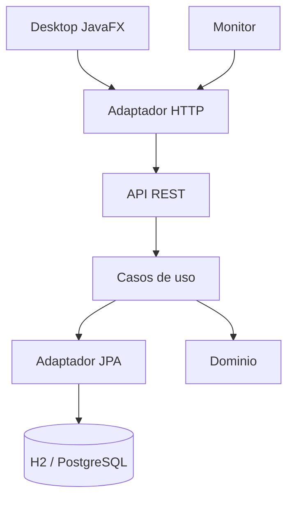

# CacaoSelva

Prueba de concepto academica que demuestra que diferentes aplicaciones pueden
consultar la misma informacion de lotes de cacao mediante una API HTTP, aplicando
Arquitectura Limpia, principios SOLID y Clean Code.

## 1. Objetivo

Construir una solucion con:

1. API REST.
2. Aplicacion Desktop (JavaFX).
3. Monitor automatico en segundo plano.
4. Dominio y casos de uso compartidos conceptualmente.
5. Persistencia de datos mediante JPA.
6. Pruebas automatizadas y pruebas de la API mediante Postman.

La aplicacion usa H2 en modo archivo de forma predeterminada, por lo que los datos
permanecen despues de reiniciar la API. Tambien incluye un perfil para PostgreSQL.

## 2. Tecnologias

- Java 21 (compilado con `--release 21`)
- Maven (multimodulo)
- Spring Boot 3.5.x / Spring Web
- Spring Data JPA
- H2 (archivo local) y PostgreSQL (perfil opcional)
- JavaFX para Desktop
- `java.net.http.HttpClient` para consumo HTTP
- JUnit 5 y Mockito
- Jackson para JSON
- SLF4J / Logback para logging

No se utiliza Lombok: el codigo es explicito para facilitar su estudio.

## 3. Arquitectura

Arquitectura Limpia. La direccion conceptual de dependencias es:

```text
Interfaces / Frameworks
        |
        v
Adaptadores
        |
        v
Aplicacion
        |
        v
Dominio
```

El modulo `domain` no depende de Spring, JavaFX, HTTP, JSON, base de datos,
controladores ni frameworks externos. El modulo `application` tampoco depende de
Spring: los beans se declaran desde `api/config/ApplicationConfig`.



## 4. Explicacion de modulos

| Modulo | Responsabilidad |
| ------ | --------------- |
| `domain` | Modelo de negocio puro (`Lote`, `EstadoLote`). |
| `application` | Puertos, DTO, excepciones y casos de uso. No conoce frameworks. |
| `infrastructure` | Adaptadores: repositorio JPA y clientes HTTP de consulta/comandos. |
| `api` | API REST Spring Boot: controlador, DTOs, mapper y manejo global de errores. |
| `desktop` | Aplicacion JavaFX que consume la API. |
| `monitor` | Proceso periodico que consulta la API y registra los pendientes. |

## 5. Estructura de carpetas

```text
cacaoselva/
|
+-- pom.xml
+-- README.md
+-- .gitignore
|
+-- docs/
|   +-- postman/
|       +-- README.md
|
+-- domain/
+-- application/
+-- infrastructure/
+-- api/
+-- desktop/
+-- monitor/
```

## 6. Como compilar

Desde la raiz del proyecto:

```bash
mvn clean install
```

Esto compila todos los modulos, ejecuta las pruebas unitarias e instala los
artefactos en el repositorio local de Maven.

Para ejecutar solo las pruebas:

```bash
mvn test
```

## 7. Como ejecutar la API

```bash
mvn -pl api spring-boot:run
```

La API queda disponible en `http://localhost:5080`.

En el primer arranque se crea `data/cacaoselva.mv.db` y se cargan 10 lotes. La
carga inicial solo se ejecuta cuando la tabla esta vacia.

Tambien se puede empaquetar y ejecutar el jar:

```bash
mvn -pl api -am package
java -jar api/target/api-1.0.0-SNAPSHOT.jar
```

Para usar PostgreSQL, crear la base `cacaoselvabd` y ejecutar:

```bash
mvn -pl api spring-boot:run -Dspring-boot.run.profiles=postgres
```

Las variables opcionales `DB_URL`, `DB_USERNAME` y `DB_PASSWORD` permiten cambiar
la conexion sin guardar credenciales en el codigo.

## 8. Como ejecutar Desktop

Con la API en ejecucion:

```bash
mvn -pl desktop javafx:run
```

Ventana: **CacaoSelva - Lotes**, con:

- Tabla de lotes y actualizacion asincrona.
- Filtros por socio y estado.
- Formulario para crear y actualizar.
- Eliminacion con confirmacion.
- Mensajes de carga, resultado y error sin bloquear la interfaz.

## 9. Como ejecutar Monitor

Con la API en ejecucion:

```bash
mvn -pl monitor exec:java
```

El monitor consulta cada 10 segundos y registra un resumen cuando cambia:

```text
Lotes: total=10, pendientes=6, liquidados=4
```

Si la API se detiene, registra la falla una sola vez y continua intentando. Al
reiniciar la API informa que la conexion fue restablecida. El intervalo puede
configurarse con `CACAOSELVA_MONITOR_INTERVAL_SECONDS` o con la propiedad Java
`cacaoselva.monitor.interval.seconds`.

## 10. Endpoints

| Metodo | Ruta | Resultado |
| ------ | ---- | --------- |
| GET | `/lotes` | 200 con los lotes almacenados |
| GET | `/lotes/1` | 200 con el lote solicitado |
| GET | `/lotes/999` | 404 Not Found |
| GET | `/lotes/0` | 400 Bad Request |
| GET | `/lotes/abc` | 400 Bad Request |
| POST | `/lotes` | 201 con el lote creado |
| PUT | `/lotes/{id}` | 200 con el lote actualizado |
| DELETE | `/lotes/{id}` | 204 sin contenido |

`POST` y `PUT` reciben el siguiente formato:

```json
{
  "socio": "Ana Torres",
  "pesoKg": 120.50,
  "estado": "PENDIENTE"
}
```

El socio es obligatorio, el peso debe ser positivo y admite hasta dos decimales,
y el estado debe ser `PENDIENTE` o `LIQUIDADO`.

## 11. Como probar con Postman

Ver [`docs/postman/README.md`](docs/postman/README.md). Coleccion
**CacaoSelva - Pruebas API** con variable `baseUrl = http://localhost:5080`.

## 12. Principios SOLID aplicados

- **SRP**: Controller, UseCase, Repository, HTTP Adapter, JavaFX Controller y
  Scheduler tienen responsabilidades separadas.
- **OCP**: el adaptador JPA puede trabajar con H2 o PostgreSQL sin modificar los
  casos de uso.
- **LSP**: cualquier implementacion correcta de `LoteRepository` sustituye a otra.
- **ISP**: interfaces pequenas y especificas (`LoteRepository`, `LoteQueryPort`).
- **DIP**: los casos de uso dependen de `LoteRepository`, no de
  `JpaLoteRepositoryAdapter`.

## 13. Decisiones de Clean Architecture

- `domain` y `application` no dependen de Spring.
- Los casos de uso no llevan `@Service`; se construyen como beans en
  `api/config/ApplicationConfig` (capa externa).
- El controlador REST no contiene logica de negocio: delega en los casos de uso.
- El controlador JavaFX no conoce `HttpRequest`, `HttpResponse` ni `ObjectMapper`;
  esos detalles viven en `HttpLoteQueryAdapter`.
- `baseUrl` y `timeout` se centralizan en `ApiHttpConfig`.
- La llamada HTTP en Desktop se ejecuta de forma asincrona con `CompletableFuture`
  y los controles se actualizan con `Platform.runLater`.

## 14. Pruebas

Pruebas unitarias (JUnit 5 + Mockito) de:

- `ListarLotesUseCase`
- `BuscarLotePorIdUseCase` (lote existente, no encontrado, id nulo, cero y negativo)
- `ContarLotesPendientesUseCase`
- Casos de uso de creacion, actualizacion y eliminacion.
- Integracion JPA y HTTP: carga inicial y CRUD completo con persistencia.
- Adaptador HTTP utilizado por Desktop.
- Resumen, cambios, caida y recuperacion del Monitor.

GitHub Actions ejecuta `mvn verify` automaticamente en cada `push` y
`pull_request` mediante `.github/workflows/ci.yml`.

## 15. Limitaciones actuales

- Sin autenticacion ni autorizacion.
- Sin despliegue ni contenedores.
- H2 es apropiado para la demostracion local; para trabajo compartido se recomienda
  activar el perfil PostgreSQL.
