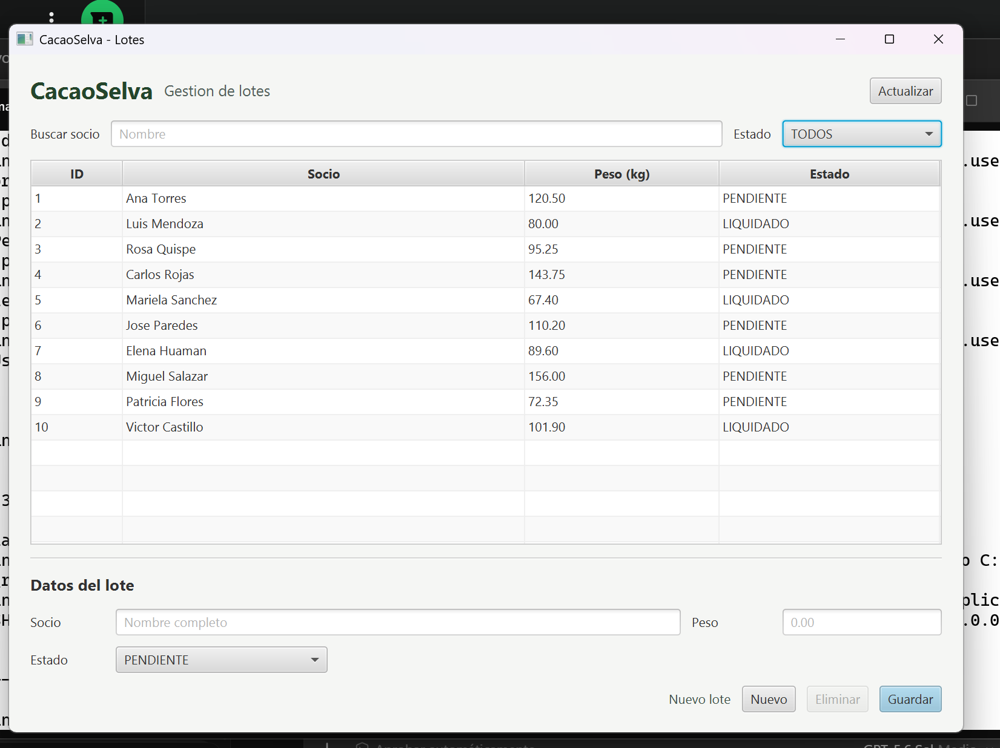
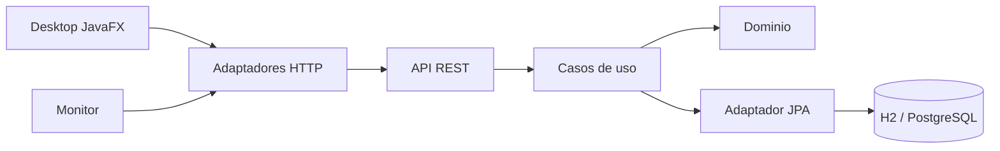

# CacaoSelva

[](https://github.com/RengiCodeMaster/cacaoselva/actions/workflows/ci.yml)


CacaoSelva es una aplicación académica para administrar lotes de cacao desde
distintos clientes conectados a una API REST común. La solución demuestra
persistencia real, operaciones CRUD, comunicación HTTP, una interfaz Desktop en
JavaFX, monitoreo automático y pruebas ejecutadas mediante integración continua.

El proyecto utiliza una estructura Maven multimódulo y conserva la dirección de
dependencias de Arquitectura Limpia: el dominio y los casos de uso permanecen
independientes de Spring, JavaFX, HTTP, JSON y la base de datos.

## Informe del proyecto

La documentación académica completa está disponible en:

**[Ver o descargar el informe CacaoSelva en PDF](Informe_CacaoSelva.pdf)**

El informe incluye el análisis inicial, las mejoras implementadas, diagramas de
arquitectura, persistencia, API REST, Desktop, Monitor, pruebas, resultados,
conclusiones y referencias con presentación académica APA 7.

## Resultado final



La aplicación Desktop permite consultar, buscar, filtrar, crear, actualizar y
eliminar lotes. Las operaciones HTTP se ejecutan de forma asíncrona para no
bloquear la interfaz.

## Funcionalidades

- Persistencia predeterminada en una base H2 almacenada en archivo.
- Perfil alternativo para PostgreSQL mediante configuración externa.
- Carga inicial condicional de 10 lotes, sin duplicarlos en cada reinicio.
- CRUD completo mediante API REST.
- Validación de identificador, socio, peso y estado.
- Cliente Desktop JavaFX con filtros y gestión de registros.
- Monitor configurable con detección de cambios, caídas y recuperación.
- Respuestas de error HTTP consistentes.
- 21 pruebas unitarias y de integración.
- Ejecución automática de `mvn verify` mediante GitHub Actions.

## Tecnologías

| Tecnología | Uso |
| --- | --- |
| Java 21 | Lenguaje y plataforma principal |
| Maven | Compilación y organización multimódulo |
| Spring Boot 3.5.x | API REST y configuración |
| Spring Data JPA | Persistencia y repositorios |
| H2 | Base persistente local predeterminada |
| PostgreSQL | Base opcional para ambientes compartidos |
| JavaFX | Cliente Desktop |
| Java HTTP Client | Comunicación con la API |
| Jackson | Procesamiento JSON |
| JUnit 5 y Mockito | Pruebas automatizadas |
| GitHub Actions | Integración continua |

No se utiliza Lombok. El código mantiene constructores, métodos y dependencias de
forma explícita para facilitar su revisión académica.

## Arquitectura



La dirección conceptual de dependencias es:

```text
Interfaces y frameworks -> Adaptadores -> Aplicación -> Dominio
```

### Responsabilidad de los módulos

| Módulo | Responsabilidad |
| --- | --- |
| `domain` | Modelo puro: `Lote` y `EstadoLote`. |
| `application` | Puertos, DTO, validaciones, excepciones y casos de uso. |
| `infrastructure` | Adaptadores JPA y clientes HTTP. |
| `api` | Controladores REST, configuración Spring y manejo de errores. |
| `desktop` | Interfaz JavaFX para administrar lotes. |
| `monitor` | Consulta periódica y detección de disponibilidad. |

## Estructura

```text
cacaoselva/
|-- .github/workflows/ci.yml
|-- api/
|-- application/
|-- desktop/
|-- docs/
|   |-- images/
|   |-- postman/
|   `-- ANALISIS_MEJORAS.md
|-- domain/
|-- infrastructure/
|-- monitor/
|-- Informe_CacaoSelva.pdf
|-- pom.xml
`-- README.md
```

## Requisitos

- JDK 21.
- Maven 3.9 o superior.
- Puerto local `5080` disponible.
- PostgreSQL únicamente para el perfil opcional `postgres`.

Comprueba las herramientas instaladas con:

```bash
java -version
mvn -version
```

## Compilación y pruebas

Desde la raíz del repositorio:

```bash
mvn clean verify
```

Este comando compila todos los módulos y ejecuta las 21 pruebas automatizadas.
Para instalar los artefactos en el repositorio Maven local:

```bash
mvn clean install
```

## Ejecución

### 1. API REST

```bash
mvn -pl api spring-boot:run
```

La API queda disponible en `http://localhost:5080`. En el primer arranque se
crea `data/cacaoselva.mv.db` y se insertan 10 registros solamente cuando la
tabla está vacía.

También puede ejecutarse el JAR:

```bash
mvn -pl api -am package
java -jar api/target/api-1.0.0-SNAPSHOT.jar
```

### 2. Desktop

Con la API activa, abre otra terminal:

```bash
mvn -pl desktop javafx:run
```

### 3. Monitor

En una tercera terminal:

```bash
mvn -pl monitor exec:java
```

El intervalo predeterminado es de 10 segundos. Puede configurarse mediante
`CACAOSELVA_MONITOR_INTERVAL_SECONDS` o la propiedad Java
`cacaoselva.monitor.interval.seconds`.

Ejemplo en PowerShell:

```powershell
$env:CACAOSELVA_MONITOR_INTERVAL_SECONDS = "30"
mvn -pl monitor exec:java
```

## Persistencia

La configuración predeterminada utiliza H2 en modo archivo. Los datos continúan
disponibles después de detener y volver a iniciar la API.

La persistencia fue comprobada mediante este flujo:

1. Iniciar la API.
2. Crear un lote con `POST /lotes`.
3. Detener completamente el proceso.
4. Iniciar nuevamente la API.
5. Recuperar el mismo registro con `GET /lotes/{id}`.

### Perfil PostgreSQL

Después de crear la base `cacaoselvabd`:

```bash
mvn -pl api spring-boot:run -Dspring-boot.run.profiles=postgres
```

| Variable | Descripción |
| --- | --- |
| `DB_URL` | URL JDBC de PostgreSQL |
| `DB_USERNAME` | Usuario de conexión |
| `DB_PASSWORD` | Contraseña de conexión |

## API REST

| Método | Ruta | Respuesta |
| --- | --- | --- |
| `GET` | `/lotes` | `200` con todos los lotes |
| `GET` | `/lotes/{id}` | `200`, `400` o `404` |
| `POST` | `/lotes` | `201` con el lote creado |
| `PUT` | `/lotes/{id}` | `200`, `400` o `404` |
| `DELETE` | `/lotes/{id}` | `204`, `400` o `404` |

Ejemplo para crear o actualizar:

```json
{
  "socio": "Ana Torres",
  "pesoKg": 120.50,
  "estado": "PENDIENTE"
}
```

Reglas principales:

- `socio` es obligatorio y admite hasta 120 caracteres.
- `pesoKg` debe ser positivo y contener como máximo dos decimales.
- `estado` debe ser `PENDIENTE` o `LIQUIDADO`.
- Los identificadores deben ser enteros positivos.

La colección y guía de Postman están en
[`docs/postman/README.md`](docs/postman/README.md).

## Monitor

El Monitor consulta periódicamente la API y genera un resumen:

```text
Lotes: total=10, pendientes=6, liquidados=4
```

Solo registra el resumen cuando existe un cambio. Si la API deja de responder,
informa la caída una vez, continúa intentando y comunica la recuperación cuando
vuelve a recibir una respuesta válida.

## Pruebas automatizadas

La suite cubre casos de uso, validaciones, persistencia JPA, carga inicial, CRUD
REST mediante `MockMvc`, adaptadores HTTP y estados del Monitor.

| Área | Pruebas |
| --- | ---: |
| Aplicación | 15 |
| Infraestructura | 1 |
| API | 1 |
| Monitor | 4 |
| **Total** | **21** |

El flujo de [GitHub Actions](https://github.com/RengiCodeMaster/cacaoselva/actions)
ejecuta `mvn --batch-mode --no-transfer-progress verify` en cada `push` y
`pull_request` sobre `main`.

## Principios de diseño

- **SRP:** cada módulo conserva una responsabilidad principal.
- **OCP:** H2 y PostgreSQL comparten el mismo contrato JPA.
- **LSP:** las implementaciones de repositorio son sustituibles.
- **ISP:** consulta y comandos HTTP utilizan interfaces específicas.
- **DIP:** la lógica depende de puertos, no de implementaciones concretas.

## Limitaciones y evolución futura

La entrega no incorpora autenticación, autorización, migraciones versionadas ni
despliegue productivo. Como evolución se recomienda añadir Flyway, contenedores,
paginación, auditoría, perfiles por ambiente y pruebas visuales automatizadas.

## Información académica

- **Autor:** Juan Manuel Rengifo Fretel
- **Curso:** Construcción de Software II
- **Docente:** Ríos Rivera, Carlos Abraham
- **Semestre:** 2026-II
