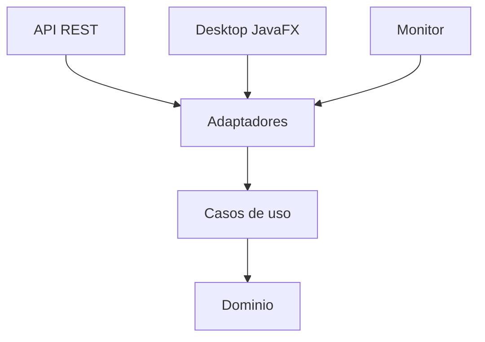

Actúa como arquitecto de software senior y desarrollador Java.

Necesito que construyas desde cero un proyecto académico llamado:

# CacaoSelva

El proyecto debe desarrollarse en **Java**, aplicando estrictamente:

* Arquitectura Limpia / Clean Architecture
* Principios SOLID
* Clean Code
* Separación de responsabilidades
* Inversión de dependencias
* Bajo acoplamiento
* Alta cohesión
* Inyección de dependencias

No quiero una aplicación monolítica donde toda la lógica esté en controladores o clases de servicio genéricas.

---

# 1. Objetivo del proyecto

Construir una prueba de concepto para demostrar que diferentes aplicaciones pueden consultar la misma información de lotes de cacao mediante una API HTTP.

La solución tendrá inicialmente:

1. API REST.
2. Aplicación Desktop.
3. Monitor automático en segundo plano.
4. Dominio y casos de uso compartidos conceptualmente.
5. Repositorio en memoria.
6. Pruebas de la API mediante Postman.

Por el momento NO implementar:

* base de datos;
* autenticación;
* autorización;
* Docker;
* frontend web;
* microservicios;
* mensajería;
* seguridad avanzada;
* despliegue en producción.

La primera versión debe mantenerse sencilla, académica y fácil de explicar.

---

# 2. Tecnologías

Utilizar:

* Java 21 LTS
* Maven
* Spring Boot 3.x
* Spring Web
* JavaFX para Desktop
* `java.net.http.HttpClient` para consumo HTTP
* JUnit 5
* Mockito
* Jackson para JSON
* SLF4J / Logback para logging

No utilizar Lombok inicialmente.

Quiero que el código sea explícito para facilitar su estudio.

---

# 3. Arquitectura

Implementar el proyecto siguiendo Arquitectura Limpia.

La dirección conceptual de dependencias debe ser:

```text
Interfaces / Frameworks
        ↓
Adaptadores
        ↓
Aplicación
        ↓
Dominio
```

El dominio debe ser completamente independiente de:

* Spring;
* JavaFX;
* HTTP;
* JSON;
* base de datos;
* controladores;
* frameworks externos.

---

# 4. Proyecto Maven multimódulo

Crear esta estructura general:

```text
cacaoselva/
│
├── pom.xml
│
├── domain/
│
├── application/
│
├── infrastructure/
│
├── api/
│
├── desktop/
│
└── monitor/
```

Cada carpeta debe ser un módulo Maven.

El `pom.xml` raíz debe actuar como parent y aggregator.

Configurar correctamente las dependencias entre módulos.

---

# 5. Módulo domain

Crear el módulo:

```text
domain
```

Este módulo debe contener exclusivamente elementos del dominio.

Paquete base:

```text
pe.edu.cacaoselva.domain
```

Crear inicialmente:

```text
domain/
└── model/
    ├── Lote.java
    └── EstadoLote.java
```

## Entidad Lote

Debe contener:

```text
id
socio
pesoKg
estado
```

Tipos recomendados:

```java
Integer id
String socio
BigDecimal pesoKg
EstadoLote estado
```

Preferentemente utilizar un `record` si resulta apropiado.

## EstadoLote

Crear un enum:

```java
PENDIENTE
LIQUIDADO
```

No utilizar anotaciones de Spring dentro de este módulo.

---

# 6. Módulo application

Crear:

```text
application
```

Paquete:

```text
pe.edu.cacaoselva.application
```

Debe contener:

```text
port/
usecase/
exception/
dto/
```

---

# 7. Puertos

Crear inicialmente:

```text
LoteRepository
LoteQueryPort
```

## LoteRepository

Debe representar el acceso a los lotes del dominio.

Métodos mínimos:

```java
List<Lote> findAll();

Optional<Lote> findById(Integer id);
```

El caso de uso debe depender de esta interfaz.

Nunca debe depender directamente de:

```text
InMemoryLoteRepository
PostgreSQL
JPA
Spring Data
```

---

# 8. Casos de uso

Crear:

```text
ListarLotesUseCase
BuscarLotePorIdUseCase
ContarLotesPendientesUseCase
```

Cada caso de uso debe tener una responsabilidad específica.

## ListarLotesUseCase

Debe obtener todos los lotes.

## BuscarLotePorIdUseCase

Debe:

1. validar que el ID no sea null;
2. validar que sea mayor que cero;
3. buscar el lote;
4. lanzar una excepción específica si no existe.

## ContarLotesPendientesUseCase

Debe contar únicamente los lotes cuyo estado sea:

```text
PENDIENTE
```

No colocar esta regla dentro del controlador REST.

---

# 9. Excepciones

Crear al menos:

```text
LoteNoEncontradoException
IdentificadorLoteInvalidoException
ApiNoDisponibleException
```

Utilizar nombres claros y específicos.

Evitar:

```java
throw new RuntimeException("error");
```

si existe una excepción más significativa.

---

# 10. Módulo infrastructure

Crear:

```text
infrastructure
```

Paquete:

```text
pe.edu.cacaoselva.infrastructure
```

Subpaquetes sugeridos:

```text
repository/
http/
config/
```

---

# 11. Repositorio en memoria

Crear:

```text
InMemoryLoteRepository
```

Debe implementar:

```text
LoteRepository
```

Debe trabajar inicialmente con estos datos:

| ID | Socio | PesoKg | Estado    |
| -: | ----- | -----: | --------- |
|  1 | Ana   |  120.5 | PENDIENTE |
|  2 | Luis  |     80 | LIQUIDADO |
|  3 | Rosa  |  95.25 | PENDIENTE |

Utilizar:

```java
BigDecimal
```

para los pesos.

No utilizar `double`.

La implementación debe ser de solo lectura.

---

# 12. API REST

Crear módulo:

```text
api
```

Utilizar Spring Boot.

Paquete base:

```text
pe.edu.cacaoselva.api
```

Estructura sugerida:

```text
controller/
config/
dto/
mapper/
exception/
```

Crear clase principal:

```text
CacaoSelvaApiApplication
```

---

# 13. Endpoints

Implementar:

## Listar lotes

```text
GET /lotes
```

Resultado:

```text
200 OK
```

Debe devolver los tres lotes.

---

## Buscar lote

```text
GET /lotes/{id}
```

Ejemplo:

```text
GET /lotes/1
```

Resultado:

```text
200 OK
```

Debe devolver a Ana.

---

## Lote inexistente

```text
GET /lotes/999
```

Resultado:

```text
404 Not Found
```

---

## Identificador inválido

```text
GET /lotes/0
```

Resultado:

```text
400 Bad Request
```

Para:

```text
GET /lotes/abc
```

también debe responder:

```text
400 Bad Request
```

---

# 14. Respuestas JSON

Ejemplo esperado para `/lotes`:

```json
[
  {
    "id": 1,
    "socio": "Ana",
    "pesoKg": 120.5,
    "estado": "PENDIENTE"
  },
  {
    "id": 2,
    "socio": "Luis",
    "pesoKg": 80,
    "estado": "LIQUIDADO"
  },
  {
    "id": 3,
    "socio": "Rosa",
    "pesoKg": 95.25,
    "estado": "PENDIENTE"
  }
]
```

Para errores utilizar una estructura consistente.

Ejemplo:

```json
{
  "status": 404,
  "message": "No existe el lote con id 999",
  "timestamp": "..."
}
```

Crear un DTO específico para errores.

---

# 15. Manejo global de excepciones

Implementar:

```text
@RestControllerAdvice
```

Crear:

```text
ApiExceptionHandler
```

Debe convertir las excepciones del sistema en respuestas HTTP.

Ejemplo:

```text
LoteNoEncontradoException
→ 404
```

```text
IdentificadorLoteInvalidoException
→ 400
```

No llenar el controlador con múltiples `try/catch`.

---

# 16. Configuración de dependencias

Configurar mediante Spring los objetos necesarios.

Los casos de uso no deben contener:

```java
@Service
```

si ello hace que la capa de aplicación dependa de Spring.

Preferir declarar los beans desde una clase de configuración ubicada en una capa externa.

Ejemplo conceptual:

```text
@Configuration
ApplicationConfig
```

que construya:

```text
LoteRepository
ListarLotesUseCase
BuscarLotePorIdUseCase
ContarLotesPendientesUseCase
```

Quiero mantener el módulo `application` independiente de Spring.

---

# 17. Puerto del servidor

Configurar la API para ejecutarse en:

```text
http://localhost:5080
```

Configurar:

```properties
server.port=5080
```

---

# 18. Aplicación Desktop

Crear módulo:

```text
desktop
```

Utilizar JavaFX.

Paquete:

```text
pe.edu.cacaoselva.desktop
```

Estructura sugerida:

```text
view/
controller/
adapter/
config/
dto/
```

La ventana debe contener:

```text
Título: CacaoSelva - Lotes

[ Consultar ]

-------------------------------------
| ID | Socio | Peso | Estado       |
-------------------------------------
|    |       |      |              |
-------------------------------------

Estado: Listo
```

---

# 19. Funcionamiento Desktop

Al iniciar:

```text
Estado: Listo
```

Al presionar:

```text
Consultar
```

mostrar:

```text
Consultando...
```

Mientras consulta, deshabilitar temporalmente el botón.

Si responde correctamente:

```text
3 lotes recibidos.
```

Mostrar los registros en un:

```text
TableView
```

Si falla:

```text
No se pudo conectar con la API.
```

No mostrar una lista antigua como si fuera información actual.

---

# 20. No bloquear JavaFX

No ejecutar una llamada HTTP bloqueante directamente en el JavaFX Application Thread.

Utilizar una estrategia asíncrona como:

```text
CompletableFuture
```

o una solución equivalente apropiada para JavaFX.

Actualizar controles gráficos mediante:

```java
Platform.runLater(...)
```

cuando corresponda.

---

# 21. Cliente HTTP

Utilizar:

```java
java.net.http.HttpClient
```

Crear un adaptador:

```text
HttpLoteQueryAdapter
```

El controlador JavaFX no debe conocer detalles como:

```text
HttpRequest
HttpResponse
ObjectMapper
```

Esos detalles deben permanecer en el adaptador.

---

# 22. Configuración HTTP

Centralizar:

```text
baseUrl
timeout
```

No repetir:

```java
"http://localhost:5080"
```

en múltiples clases.

Crear configuración clara.

Tiempo máximo sugerido:

```text
5 segundos
```

---

# 23. Monitor

Crear módulo:

```text
monitor
```

El Monitor debe ejecutarse como aplicación Java independiente.

Debe:

1. iniciarse;
2. consultar la API;
3. obtener los lotes;
4. contar los pendientes;
5. registrar el resultado;
6. esperar 10 segundos;
7. repetir.

Resultado esperado:

```text
Pendientes: 2
```

---

# 24. Ejecución periódica

Utilizar preferentemente:

```java
ScheduledExecutorService
```

con:

```text
scheduleWithFixedDelay
```

No utilizar:

```java
while(true)
```

con lógica desorganizada.

Definir el intervalo como constante:

```java
Duration.ofSeconds(10)
```

o mediante configuración.

---

# 25. Recuperación del Monitor

Si la API se detiene, el Monitor debe:

```text
detectar la falla
↓
registrarla
↓
esperar
↓
volver a intentar
```

No debe cerrarse por una falla temporal.

Después de reiniciar la API debe volver a mostrar:

```text
Pendientes: 2
```

---

# 26. Clean Code

Aplicar estrictamente estas reglas:

* nombres claros;
* métodos pequeños;
* una responsabilidad por clase;
* evitar métodos gigantes;
* evitar clases `Manager` genéricas;
* evitar lógica duplicada;
* evitar números mágicos;
* evitar `catch (Exception)` cuando sea posible utilizar excepciones concretas;
* evitar comentarios que expliquen código confuso;
* preferir código autoexplicativo;
* no crear abstracciones innecesarias;
* mantener las soluciones simples.

---

# 27. SOLID

La implementación debe demostrar explícitamente:

## SRP

Separar:

```text
Controller
UseCase
Repository
HTTP Adapter
JavaFX Controller
Scheduler
```

## OCP

Debe ser posible crear en el futuro:

```text
PostgresLoteRepository
```

sin modificar los casos de uso existentes.

## LSP

Cualquier implementación correcta de:

```text
LoteRepository
```

debe poder sustituir a otra.

## ISP

Crear interfaces pequeñas y específicas.

No crear:

```text
SistemaService
SistemaRepository
GeneralManager
```

con decenas de responsabilidades.

## DIP

Los casos de uso deben depender de:

```text
LoteRepository
```

y no de:

```text
InMemoryLoteRepository
```

---

# 28. Pruebas unitarias

Crear pruebas unitarias para al menos:

```text
ListarLotesUseCase
BuscarLotePorIdUseCase
ContarLotesPendientesUseCase
```

Utilizar:

```text
JUnit 5
Mockito
```

Comprobar:

### ListarLotesUseCase

Debe retornar los registros proporcionados por el repositorio.

### BuscarLotePorIdUseCase

Debe devolver un lote existente.

Debe lanzar:

```text
LoteNoEncontradoException
```

cuando no exista.

Debe rechazar IDs inválidos.

### ContarLotesPendientesUseCase

Con los datos iniciales debe devolver:

```text
2
```

---

# 29. Comprobación mediante Postman

Preparar la API para que pueda comprobarse con Postman.

Crear un archivo:

```text
docs/postman/README.md
```

explicando cómo crear la colección:

```text
CacaoSelva - Pruebas API
```

Variable:

```text
baseUrl = http://localhost:5080
```

Peticiones:

```text
P01 - GET {{baseUrl}}/lotes

P02 - GET {{baseUrl}}/lotes/1

P03 - GET {{baseUrl}}/lotes/999

P04A - GET {{baseUrl}}/lotes/abc

P04B - GET {{baseUrl}}/lotes/0
```

Resultados:

```text
P01 → 200
P02 → 200
P03 → 404
P04A → 400
P04B → 400
```

---

# 30. Tests sugeridos para Postman

Documentar también estos scripts.

## P01

```javascript
pm.test("La respuesta es 200", function () {
    pm.response.to.have.status(200);
});

pm.test("La respuesta contiene 3 lotes", function () {
    const datos = pm.response.json();

    pm.expect(datos).to.be.an("array");
    pm.expect(datos.length).to.eql(3);
});

pm.test("Existen 2 lotes pendientes", function () {
    const datos = pm.response.json();

    const pendientes = datos.filter(
        lote => lote.estado === "PENDIENTE"
    );

    pm.expect(pendientes.length).to.eql(2);
});
```

## P03

```javascript
pm.test("Lote inexistente retorna 404", function () {
    pm.response.to.have.status(404);
});
```

## P04

```javascript
pm.test("Identificador inválido retorna 400", function () {
    pm.response.to.have.status(400);
});
```

---

# 31. README principal

Crear un:

```text
README.md
```

claro y académico.

Debe contener:

1. nombre del proyecto;
2. objetivo;
3. tecnologías;
4. arquitectura;
5. explicación de módulos;
6. estructura de carpetas;
7. cómo compilar;
8. cómo ejecutar la API;
9. cómo ejecutar Desktop;
10. cómo ejecutar Monitor;
11. endpoints;
12. cómo probar con Postman;
13. principios SOLID aplicados;
14. decisiones de Clean Architecture;
15. limitaciones actuales.

---

# 32. Diagrama en README

Agregar Mermaid:



---

# 33. No hacer sobreingeniería

Este proyecto es educativo.

Por lo tanto:

NO crear innecesariamente:

* Event Bus;
* Kafka;
* RabbitMQ;
* CQRS;
* Event Sourcing;
* Kubernetes;
* microservicios;
* DDD complejo;
* docenas de interfaces sin utilidad;
* patrones únicamente para aparentar arquitectura.

Aplicar Arquitectura Limpia de manera simple, comprensible y justificable.

---

# 34. Revisión antes de finalizar

Antes de considerar terminado el proyecto, revisa:

### Arquitectura

* ¿domain depende de Spring?

  * Debe ser NO.

* ¿application depende de Spring?

  * Debe ser NO.

* ¿los casos de uso dependen de implementaciones concretas?

  * Debe ser NO.

* ¿el controlador contiene lógica de negocio?

  * Debe ser NO.

* ¿JavaFX contiene reglas de negocio?

  * Debe ser NO.

### SOLID

Verificar especialmente:

```text
SRP
DIP
ISP
```

### Clean Code

Comprobar:

* nombres;
* tamaño de métodos;
* duplicación;
* manejo de excepciones;
* constantes;
* responsabilidades.

---

# 35. Criterios de aceptación finales

El proyecto se considera correcto cuando:

### API

```text
GET /lotes
```

retorna:

```text
200 + 3 lotes
```

### Consulta individual

```text
GET /lotes/1
```

retorna:

```text
200 + Ana
```

### No encontrado

```text
GET /lotes/999
```

retorna:

```text
404
```

### Entrada incorrecta

```text
GET /lotes/abc
GET /lotes/0
```

retornan:

```text
400
```

### Desktop

Al presionar:

```text
Consultar
```

muestra los tres registros.

### Monitor

Registra periódicamente:

```text
Pendientes: 2
```

### Falla

Cuando la API se detiene:

```text
Desktop → informa la falla

Monitor → informa la falla y continúa ejecutándose

Postman → muestra error de conexión
```

Cuando se reinicia:

```text
Postman → vuelve a responder 200

Monitor → vuelve a mostrar Pendientes: 2
```

---

# 36. Forma de trabajo

No generes todo de forma desordenada.

Trabaja en este orden:

```text
1. Crear estructura Maven multimódulo.
2. Configurar pom padre.
3. Crear domain.
4. Crear application.
5. Crear puertos.
6. Crear casos de uso.
7. Crear pruebas unitarias del application.
8. Crear infrastructure.
9. Crear repositorio en memoria.
10. Crear API.
11. Configurar manejo de excepciones.
12. Verificar API.
13. Crear Desktop.
14. Crear adaptador HTTP.
15. Crear Monitor.
16. Crear documentación Postman.
17. Crear README.
18. Ejecutar pruebas Maven.
19. Revisar arquitectura y dependencias.
```

Después de implementar, ejecuta las pruebas disponibles y corrige los errores de compilación antes de dar el trabajo por terminado.

---

# 37. Resultado esperado de Codex

Al finalizar quiero recibir un proyecto que pueda abrir directamente en IntelliJ IDEA o VS Code y cuya raíz tenga aproximadamente:

```text
cacaoselva/
│
├── pom.xml
├── README.md
├── .gitignore
│
├── docs/
│   └── postman/
│       └── README.md
│
├── domain/
├── application/
├── infrastructure/
├── api/
├── desktop/
└── monitor/
```

No dejes pseudocódigo en las partes esenciales.

Implementa código funcional, compilable y coherente con la arquitectura definida.

Al finalizar, muéstrame:

1. estructura final de carpetas;
2. módulos Maven creados;
3. clases principales;
4. dependencias entre módulos;
5. comandos para compilar;
6. comando para ejecutar API;
7. comando para ejecutar Desktop;
8. comando para ejecutar Monitor;
9. endpoints disponibles;
10. pruebas realizadas;
11. cualquier decisión técnica importante tomada durante la implementación.
